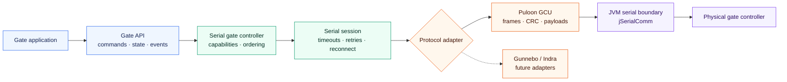

<div align="center">

# AFC Gate SDK

### One Kotlin API. Multiple gate vendors. Reliable serial control.

Control entry, exit, rejection, emergency operation, status, sensors, settings,
diagnostics, and lifecycle through one vendor-neutral interface.

[](https://github.com/GtechGovind/afc-gate-sdk/actions/workflows/ci.yml)
[](https://kotlinlang.org/docs/multiplatform.html)
[](https://openjdk.org/projects/jdk/17/)
[](#public-api)
[](#build-and-verify)
[](#build-and-verify)

[Quick start](#quick-start) · [Commands](#send-gate-commands) ·
[Architecture](#how-it-works) · [Documentation](#documentation) ·
[Adding a vendor](docs/ADDING_A_GATE.md)

</div>

---

AFC Gate SDK is a Kotlin Multiplatform library for serial automatic-fare-
collection gates. Applications use the single `Gate` contract; protocol frames,
CRC handling, response correlation, serial I/O, retries, and vendor-specific
payloads stay internal.

> **Implementation status:** Puloon GCU is implemented and covered by
> deterministic protocol tests. Gunnebo and Indra are represented in the common
> vendor model but return `GateError.UnsupportedVendor` until their protocol
> adapters are implemented and verified.

## Why AFC Gate SDK?

| One application API | Safe serial runtime | Extensible vendor boundary |
|---|---|---|
| Entry, exit, status, configuration, and maintenance use the same typed `Gate` interface. | Requests are serialized, buffers are bounded, cancellation is preserved, and malformed input is rejected. | A protocol adapter owns framing and payload translation without leaking vendor commands into application code. |

Core guarantees:

- **No public raw-byte escape hatch** — consumers cannot bypass validation or
  depend on vendor wire values.
- **Typed failures** — transport, timeout, protocol, device, configuration, and
  capability failures are represented by `GateError`.
- **Safe reconnection** — monitoring resumes after recovery, but state-changing
  commands are never replayed automatically.
- **Conservative retries** — only idempotent reads are retried; writes and
  actuator commands are attempted once.
- **Concurrent caller safety** — coroutines may call the SDK concurrently while
  one ordered transaction stream owns the physical serial connection.
- **Capability-first operation** — unsupported operations fail before serial
  bytes are written.

## Quick start

### 1. Publish the development build

The SDK is not yet published to a remote Maven registry. Install the current
snapshot into Maven Local:

```bash
./gradlew publishToMavenLocal
```

### 2. Add the dependency

```kotlin
repositories {
    mavenLocal()
    mavenCentral()
}

kotlin {
    sourceSets {
        commonMain.dependencies {
            implementation("com.qurkos.afc:afc-gate-sdk:0.1.0-SNAPSHOT")
        }
    }
}
```

The Maven group identifies the AFC artifact. Consumer code imports the shorter
`com.qurkos.gate.sdk` package.

### 3. Create and connect a gate

```kotlin
import com.qurkos.gate.sdk.Gate
import com.qurkos.gate.sdk.GateDeviceConfig
import com.qurkos.gate.sdk.GateError
import com.qurkos.gate.sdk.GateHardwareProfile
import com.qurkos.gate.sdk.GateModule
import com.qurkos.gate.sdk.GateResult
import com.qurkos.gate.sdk.GateSdk
import com.qurkos.gate.sdk.GateSite
import com.qurkos.gate.sdk.GateVendor
import com.qurkos.gate.sdk.SerialConnectionConfig
import com.qurkos.gate.sdk.SerialPortName

val created = GateSdk.create(
    GateDeviceConfig(
        vendor = GateVendor.PULOON,
        serial = SerialConnectionConfig(
            port = SerialPortName("/dev/ttyUSB0"),
        ),
        hardware = GateHardwareProfile(
            site = GateSite.INDIA,
            modules = setOf(GateModule.UPS),
        ),
    ),
)

val gate: Gate = when (created) {
    is GateResult.Success -> created.value
    is GateResult.Failure -> error("Gate configuration failed: ${created.error}")
}

when (val result = gate.connect()) {
    is GateResult.Success -> println("Gate connected")
    is GateResult.Failure -> error("Connection failed: ${result.error}")
}
```

`GateSdk.create` validates configuration but does not open a serial port.
`GateSdk.serialPorts()` returns the ports currently visible to the JVM host.

## Send gate commands

The convenience methods below are common to every vendor adapter:

```kotlin
import com.qurkos.gate.sdk.GateDirection
import com.qurkos.gate.sdk.GateLampColor
import com.qurkos.gate.sdk.GatePassMode

gate.allowEntry()
gate.allowEntry(passengerCount = 2, lampColor = GateLampColor.BLUE)
gate.allowExit()
gate.rejectPassage(GateDirection.ENTRY)
gate.setEmergency(enabled = true)
gate.setPassMode(GatePassMode.CONTROLLED_BOTH)
```

Every operation returns `GateResult<T>`:

```kotlin
when (val result = gate.allowEntry()) {
    is GateResult.Success -> audit("Entry authorized")
    is GateResult.Failure -> when (val error = result.error) {
        is GateError.UnsupportedCapability -> disableUnsupportedAction(error)
        else -> reportGateFailure(error)
    }
}
```

Treat a timeout from a state-changing command as an unknown device outcome: the
controller may have applied the command even when its acknowledgement was lost.
Inspect status before deciding what to do next.

## Observe live state

```kotlin
import kotlinx.coroutines.coroutineScope
import kotlinx.coroutines.launch

coroutineScope {
    launch {
        gate.connectionState.collect { state -> println("connection=$state") }
    }
    launch {
        gate.status.collect { status -> println("status=$status") }
    }
    launch {
        gate.events.collect { event -> println("event=$event") }
    }
}
```

`connectionState` always has a value. `status` is `null` until the first valid
status response. Events provide observation and diagnostics; the `GateResult`
returned by each command remains the authoritative operation outcome.

Release the port when its owning application component stops:

```kotlin
gate.disconnect()
```

## How it works



`SerialGateController` implements `Gate` once. `SerialSession` owns connection
state and transaction lifecycle. Each adapter translates vendor-neutral
operations into correlated protocol transactions. Java APIs and jSerialComm are
isolated in `jvmMain`.

## Public API

Applications depend only on `com.qurkos.gate.sdk.*`.

| Area | Operations |
|---|---|
| Lifecycle | Connect, disconnect, connection state, automatic recovery |
| Passage | Entry, exit, invalid-ticket rejection, passenger count, lamps |
| Control | Emergency state, pass mode, initialization, safety region |
| Monitoring | Status, events, sensors, firmware, counters, power state |
| Configuration | Clock, standby, door timing, UPS delay, typed settings |
| Maintenance | Capability-gated diagnostics and controller reset |

Protocol codecs, frames, serial transports, and vendor wire values are internal
and excluded from ABI validation.

## Supported vendors

| Vendor | Adapter | Status |
|---|---|---|
| Puloon GCU | Framing, CRC, commands, responses, settings, status | ✅ Implemented |
| Gunnebo | Reserved adapter boundary | 🧭 Protocol specification required |
| Indra | Reserved adapter boundary | 🧭 Protocol specification required |

See [Puloon protocol coverage](docs/PULOON.md) and the source
[GCU protocol reference](docs/PULOON_GCU.pdf).

## Build and verify

JDK 17 or newer is required.

```bash
./gradlew clean
./gradlew check dokkaGeneratePublicationHtml publishToMavenLocal
```

The verification gate includes:

- Kotlin compiler warnings as errors
- 43 deterministic, hardware-independent tests
- ktlint using official Kotlin style
- Detekt with warning-level findings treated as failures
- Kotlin public ABI compatibility validation
- Kover coverage enforcement and XML reporting
- Strict public and internal KDoc generation
- Reproducible JAR ordering and timestamps
- JVM and Kotlin Multiplatform Maven publications

Generated API documentation is written to `build/documentation/html`.

## Repository map

```text
src/commonMain/     Public API, shared serial runtime, and protocol adapters
src/jvmMain/        jSerialComm transport and JVM platform integration
src/commonTest/     Contract, session, payload, framing, and adapter tests
src/jvmTest/        JVM serial-boundary tests
api/                Reviewed public ABI snapshot
config/             Static-analysis configuration
docs/               Architecture, integration, operations, and vendor guides
.github/            CI, dependency review, CodeQL, and release automation
```

## Documentation

- [Architecture](docs/ARCHITECTURE.md)
- [Application integration](docs/INTEGRATION.md)
- [Error-handling contract](docs/ERROR_HANDLING.md)
- [Operations and troubleshooting](docs/OPERATIONS.md)
- [Performance and deployment tuning](docs/PERFORMANCE.md)
- [Puloon protocol and command coverage](docs/PULOON.md)
- [Adding another gate vendor](docs/ADDING_A_GATE.md)
- [Testing strategy](docs/TESTING.md)
- [Release process](docs/RELEASE.md)
- [Generated API documentation setup](docs/API.md)

## Adding another vendor

A new implementation supplies framing, payload translation, correlation rules,
capabilities, safe polling limits, and serial defaults behind
`GateProtocolAdapter`. It must not add a second public controller API or expose
raw vendor commands. Follow [Adding a gate](docs/ADDING_A_GATE.md) for the
required implementation and conformance tests.

## Security and operations

Read [SECURITY.md](SECURITY.md) before reporting a vulnerability. Production
deployments should follow the ownership, shutdown, reconnection, timeout, and
hardware-in-the-loop guidance in the [integration](docs/INTEGRATION.md) and
[operations](docs/OPERATIONS.md) guides.
